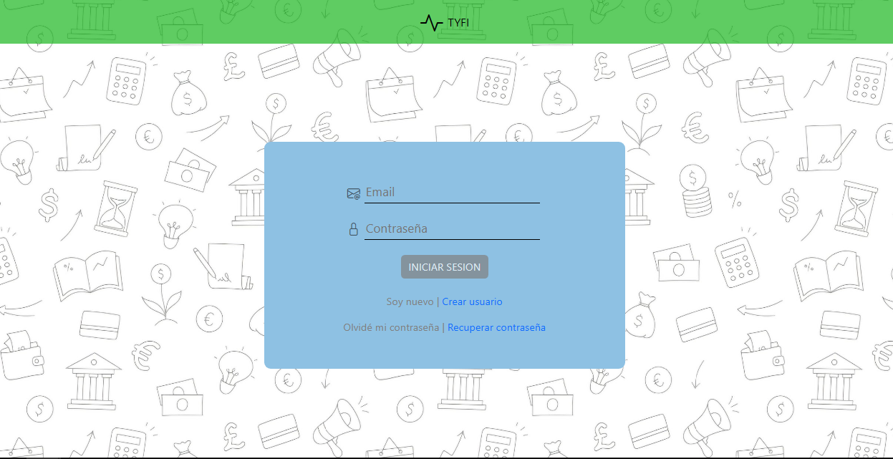
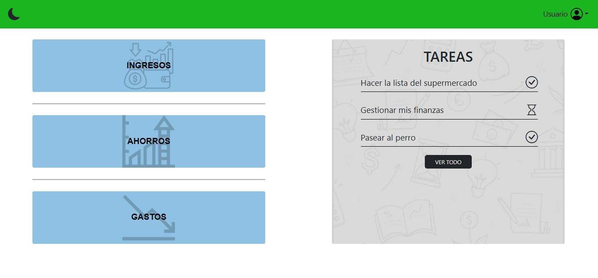
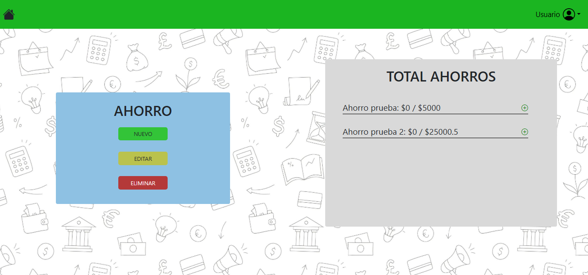
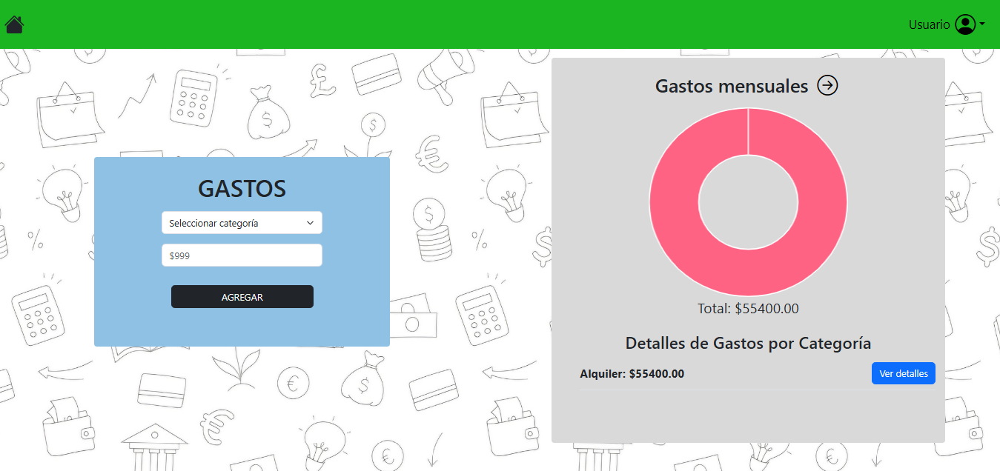
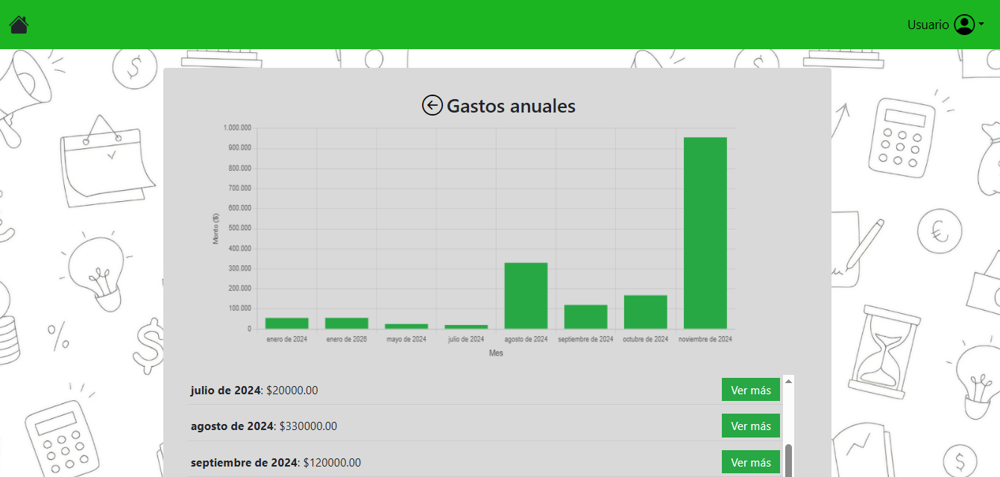
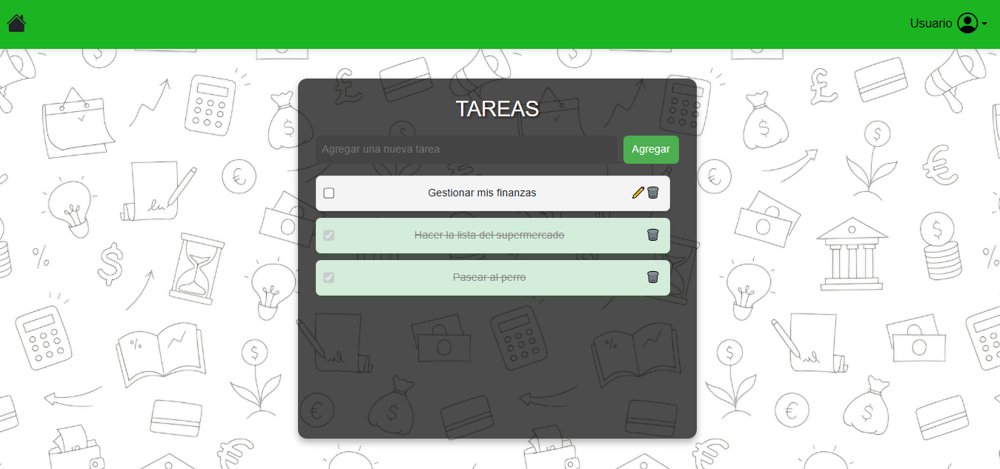
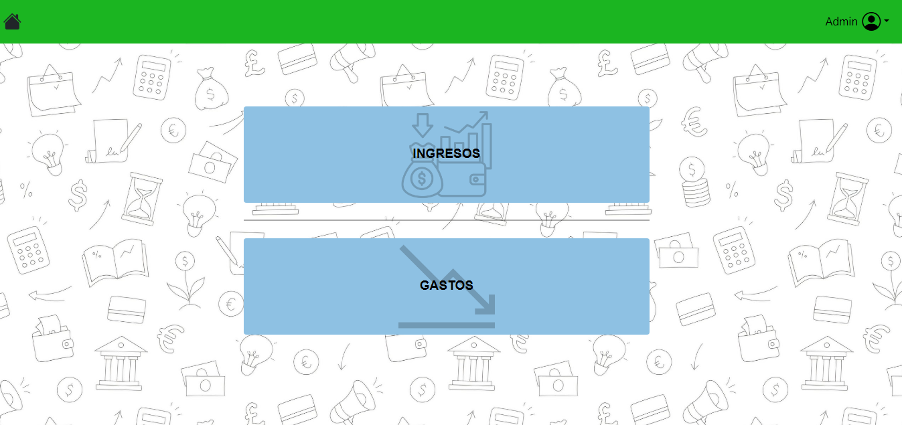
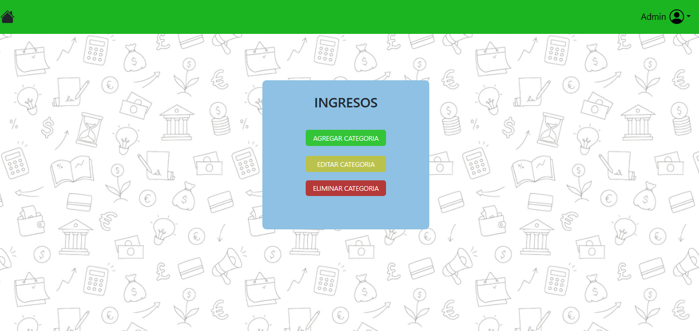

# Gestión de Finanzas y Tareas — Frontend

Frontend web en Spring Boot + Thymeleaf para la aplicación de gestión de finanzas personales y tareas. Provee vistas HTML y controladores que interactúan con un backend vía HTTP (por defecto en `http://localhost:8080`).

## Características principales

- **Autenticación**: login/logout y validación de token.
- **Dashboard de usuario y admin**.
- **Gestión financiera**:
  - Ingresos
  - Gastos
  - Ahorros
  - Reporte de gastos mensuales
- **Gestión de tareas** (crear, completar, renombrar, eliminar).
- **Recuperación de contraseña** (verificar email, enviar código, cambiar contraseña).

## Tecnologías

- Java 17
- Spring Boot 3.2.x
- Spring MVC + Thymeleaf
- Maven
- JSON (org.json)

## Requisitos

- JDK 17
- Maven

## Configuración

El servidor corre en el puerto **8081**:

Para compilar el proyecto, utiliza el siguiente comando:

```bash
mvn clean install
```
## Notas

Este proyecto es el FrontEnd de https://github.com/ignaciofranco2003/Gestor-finanzas-y-tareas

## Capturas del sistema (Usuario)

**Login**



**Panel Principal**



**Gestion de Ingresos**


**Gestion de Ahorros**



**Gestion de Gastos Mensual**



**Gestion de Gastos Anual**



**Gestion de tareas**



## Capturas del sistema (Admin)

La aplicacion cuenta tambien con un login en modo admin desde el cual se pueden gestionar las categorias de Ingresos y Gastos.

**Panel Admin**



**Vista General**

- Ambas opciones tienen un menú identico


